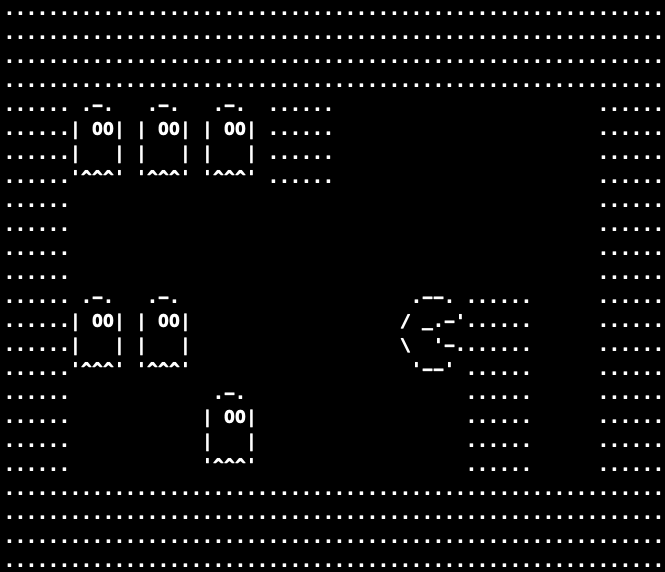

## ✨ Jogo Foge-Foge

### ALURA 🚀  C III - Recursos avançados da linguagem

- ### 💻 C
    - 01-Matriz
    - 02-Stricts
    - 03-Ponteiros de Ponteiros
    - 04-Função Recursiva
    - 05-Ascii art
    
- ### 🖥 Rodar o Jogo
    - 01-Clone 
       
            git clone https://github.com/wwwillian/Jogo_C_fogefoge.git
      
    - 02-Entre na pasta
            
            cd Jogo_C_fogefoge
    
    - 03-Rode o comando para compilar o arquivo em C
            
            gcc fogefoge.c mapa.c ui.c -o fogefoge.out 
    
    - 04-Rode o jogo
        
            ./fogefoge.out 

- ### 🕹 Jogar o jogo  
    - 01 - CIMA 'w'
    - 02 - BAIXO 's'
    - 03 - DIREITA 'd'
    - 04 - ESQUERDA 'a'
    - 05 - BOMBA 'b'

<h1 align="center">
  
</h1>

### 📝 Licença
Esse projeto está sob a licença MIT. Veja o arquivo LICENSE para mais detalhes.